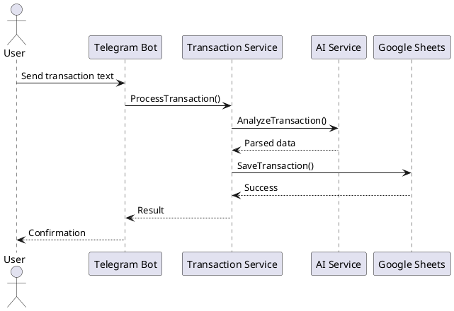

# Money Tracker Bot - AI Development Context

## Project Overview
Telegram bot for financial transaction tracking using Google Sheets and AI analysis. Go 1.23, hexagonal architecture.

## Architecture
```
cmd/telebot/main.go            # Entry point, dependency injection
internal/
├── errors/                    # ✅ Centralized error handling (Phase 1 complete)
├── adapters/                  # External integrations
│   ├── telegram/             # Bot API
│   ├── google/spreadsheet/   # Sheets integration
│   └── gemini/               # AI service
├── service/transactions/     # Business logic
├── domain/transactions/      # Domain models
└── port/out/ai/             # Interface definitions
```

## Error Infrastructure (Phase 1 Complete)
Complete error handling system with structured errors, context, retry logic, and graceful degradation.

### Key Error Constructors
- `errors.NewConfigError()` - Critical startup issues
- `errors.NewTelegramError()` - Bot API issues
- `errors.NewGeminiError()` - AI service issues
- `errors.NewSpreadsheetError()` - Sheets issues
- `errors.NewValidationError()` - Input validation
- `errors.NewNetworkError()` - Connectivity (retryable)

### Usage Patterns
```go
// Replace log.Fatal
return errors.NewConfigError("init failed", err)

// Add context
err := errors.NewTelegramError("send failed", cause)
err.WithContext("user_id", userID).WithComponent("handler")

// Check retryability
if errors.IsRetryableError(err) { /* retry logic */ }

// Handle gracefully
errors.HandleError(err, "operation context")
```

## Migration Status
- ✅ Phase 1: Error package complete
- ⏳ Phase 2: Replace `log.Fatal` calls in:
  - `internal/adapters/google/spreadsheet/client.go:32,45,65,108`
  - `internal/adapters/telegram/handler.go:32,60`
  - `internal/adapters/gemini/gemini.go:43`

## Development Commands
- `make run` - Start bot (needs TELEGRAM_BOT_TOKEN, GEMINI_API_KEY)
- `make test` - Run tests with coverage
- `make fmt && make lint` - Format and check code

## Key Guidelines
1. **Follow coding standards** in `CODING-GUIDELINES.md` for all development
2. **Always use error constructors** from `internal/errors`
3. **Add context** to errors for debugging
4. **Return errors** instead of using `log.Fatal`
5. **Follow hexagonal boundaries** - no external SDKs in domain
6. **Write tests** for both success and error cases

## Development Flow for New Code
When writing new code, follow this mandatory checklist:

### 1. Code Quality Standards
- **Follow all standards** in `CODING-GUIDELINES.md`
- **Use proper Go conventions** (naming, formatting, imports)
- **Apply hexagonal architecture** principles
- **Implement proper error handling** with context

### 2. Documentation Updates
- **Update package AI.md**: Reflect feature/business changes and new patterns
- **Function documentation**: Add comprehensive docstrings per `CODING-GUIDELINES.md`
```go
// ProcessTransaction analyzes transaction text and extracts structured data.
// Input: "Coffee at Starbucks $4.50"
// Output: Transaction{Amount: 4.50, Category: "Food", Merchant: "Starbucks"}
func ProcessTransaction(text string) (*Transaction, error) {
```

### 3. Test Coverage Requirements
- **Unit tests mandatory** for all new functions
- **Minimum 85% coverage** for new code
- **Test both success and error paths**
- **Follow testing patterns** in `CODING-GUIDELINES.md`
- Run `go test -cover ./...` to verify coverage

### 4. Diagrams (When Needed)
Use PlantUML format for architectural diagrams:


### 5. Pre-commit Checklist
- [ ] Code follows `CODING-GUIDELINES.md` standards
- [ ] Package AI.md updated
- [ ] Function docstrings with examples added
- [ ] Unit tests written (≥85% coverage)
- [ ] `make test` passes
- [ ] `make fmt && make lint` clean
- [ ] Security guidelines followed
- [ ] Diagrams added if architectural changes

## Current Branch: feature/phase1-error-infrastructure
Ready to begin Phase 2 migration of `log.Fatal` calls.
